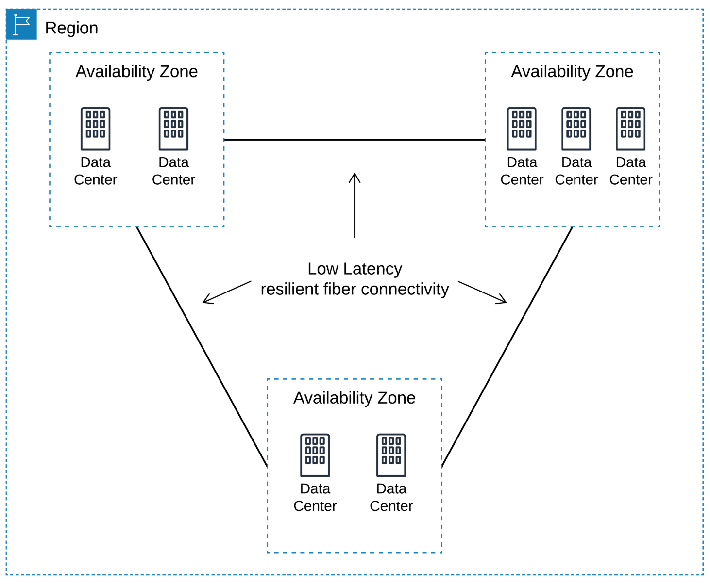
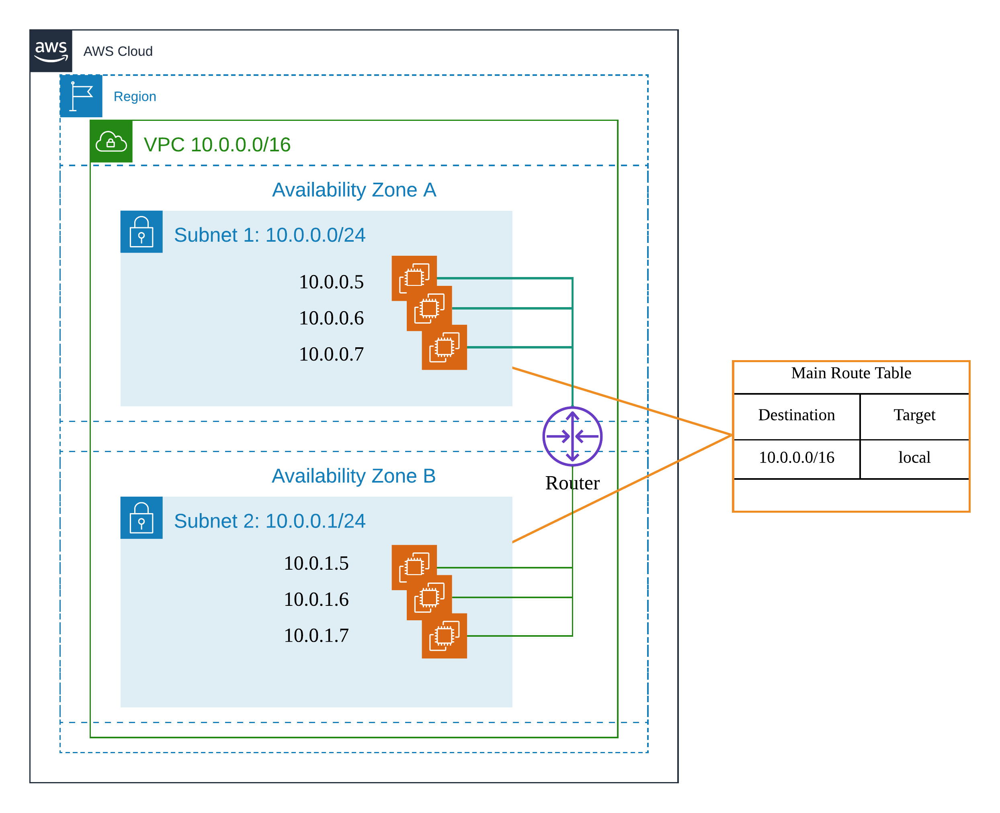

### AWS Global Infrastructure: Availability Zones

Availability Zones and Regions are closely related.

AZs are essentially the physical data centers of AWS. This is where the actual compute, storage, network, and database resources are hosted that we as consumers provision within our Virtual Private Clouds (VPCs). A common misconception is that a single availability zone is equal to a single data center. This is not the case. In fact, it’s likely that multiple data centers located close together form a single availability zone.

Each AZ will always have at least one other AZ that is geographically located within the same area, usually a city, linked by highly resilient and very low latency private fiber optic connections. However, each AZ will be isolated from the others using separate power and network connectivity that minimizes impact to other AZs should a single AZ fail.

These low latency links between AZs are used by many AWS services to replicate data for high availability and resilience purposes. For example, when RDS (Relational Database Service) is configured for ‘Multi-AZ’ deployments, AWS will use synchronous replication between its primary and secondary database and asynchronous replication for any read replicas that have been created.

Often, there are three, four, or even five AZs linked together via these low latency connections. This localized geographical grouping of multiple AZs, which would include multiple data centers, is defined as an AWS Region.



Multiple AZs within a region allows you to create highly available and resilient applications and services. By architecting your solutions to utilize resources across more than one AZ ensures that minimal or no impact will occur to your infrastructure should an AZ experience a failure, which does happen.

Anyone can deploy resources in the cloud, but architecting them in a way that ensures your infrastructure remains stable, available, and resilient when faced with a disaster is a different matter. Making use of at least two AZs in a region helps you maintain high availability of your infrastructure and its always a recommended best practice.

### AWS Global Infrastructure: Regions

As we now know, a Region is a collection of availability zones that are geographically located close to one other. This is generally indicated by AZs within the same city. AWS has deployed them across the globe to allow its worldwide customer base to take advantage of low latency connections. Every Region will act independently of the others, and each will contain at least two Availability Zones.

For example, if an organization based in London was serving customers throughout Europe, there would be no logical sense to deploy services in the Sydney Region simply due to the latency response times for its customers. Instead, the company would select the region most appropriate for them and their customer base, which may be the London, Frankfurt, or Ireland Region.

Having global regions also allows for compliance with regulations, laws, and governance relating to data storage (at rest and in transit). For example, you may be required to keep all data within a specific location, such as Europe. Having multiple regions within this location allows an organization to meet this requirement.

Similarly to how utilizing multiple AZs within a region creates a level of high availability, the same can be applied to utilizing multiple regions. Depending on the level of business continuity you require, you may choose to architect your AWS environment to support your applications and services across multiple regions, should an entire region become unavailable, perhaps due to a natural disaster.

You may want to use multiple regions if you are a global organization serving customers in different countries that have specific laws and governance about the use of data. In this case, you could even connect different VPCs together in different regions.

Interestingly, not all AWS services are available in every region. This is a consideration that must be taken into account when architecting your infrastructure. Some services are classed as global services, such as AWS Identity & Access Management (IAM) or Amazon CloudFront, which means that these services are not tied to a specific region.  However, most services are region-specific, and it’s down to you to understand which services are available in which region. [This table provides a definitive list of all services and the regions where they operate](https://aws.amazon.com/about-aws/global-infrastructure/regional-product-services/).

### VPC

The Amazon Virtual Private Cloud(VPC) is a custom-defined virtual network within the AWS Cloud. You can provision your own logically isolated section of AWS, similar to desiging and implementing a separate independent network that would operate in an on-premises data center.

Amazon VPC is the networking layer for Amzaon Elastic Compute Cloud(Amazon EC2), and it allows you to build your own virtual network within AWS. You contorl various aspects of your Amazon VPC, including:
- Selecting your own IP address range.
- Creating your own subnets
- Configuring your own route tables, network gateways, and security setting.

Within a region, you can create multiple Amazon VPCs, and each Amazon VPC is logically isolated even if it shares its IP address space.

When you create an Amazon VPC, you must specify the IPv4 address range by choosing a Classless Inter-Domain Routing(CIDR) block, such as 10.0.0.0/16. The address range of the Amazon VPC cannot be changed after the Amazon VPCs created. An Amazon VPC address range may be as large as `/16`(65536 available addresses) or as small as `/28`(16 available addresses) and should not overlap any other network with which they are to be connected.



### Subnets

A subnet is a segment of an Amazon VPC's IP address range where you can launch AWS resources, CIDR define subnets. The smallest subnet that you can create is a `/28`(16 IP address). **AWS reserves that first four IP addresses and the last IP address of every subnet for internal networking purposes**.

- 10.0.0.0: Network address.
- 10.0.0.1: Reserved by AWS for the VPC router.
- 10.0.0.2: Reserved by AWS. The IP address of the DNS server is always the base of the VPC network range plus two; however, we also reserve the base of each subnet range plus two. For VPCs with multiple CIDR blocks, the IP address of the DNS server is located in the primary CIDR.
- 10.0.0.3: Reserved by AWS for future use.
- 10.0.0.255: Network broadcast address. We do not support broadcast in a VPC, therefore we reserve this address.

After creating an Amazon VPC, you can add one or more subnets in each Availability Zone. **Subnets reside within one Availabiltiy Zone and cannot span zones.**

Subnets can be classified as public, private, or VPN-only. 
- A public subnet is one in which the associated route table directs the subnet's traffic to the Amazon VPC's IGW.
- A private subnet is one in which the associated route table does not direct the subnet's traffic to the Amazon VPC's IGW.
- A VPN-only subnet is one in which the associated route table directs the subnet's traffic to the Amazon VPC's VPG and does not have a route to the IGW. 

Regardless of the type of subnet, the internal IP address range of the subnet is always private(that is non-routable on the internet).

### Route Tables

A route table is a logical construct within an Amazon VPC that contains a set of rules that are applied to the subnet and used to determine where network traffic is directed. You can modify the route tables and add your own custom routes. You can also use route tables to specify which subnets are public(by directing Internet traffic to the IGW) and which subnets are private(by not having a route that directs traffic to IGW).

Each route table contains a default route called the local route, which enables communication within the Amazon VPC, and this route cannot be modified or removed. Additional route can be added to direct traffic to exit the Amazon VPC via the IGW, the VPC, or the NAT instance.

You should remember the following points about route tables:

- Your VPC has an implicit router.
- Your VPC automitically comes with a main route table that you can modify.
- You can create additional custom route tables for your VPC.
- Each subnet must be associated with a route table, which controls the routing for the subnet. If you don't explicitly associate a subnet with a particular route table, the subnet uses the main route table.
- You can replace main route table with a custom table that you've created so that each new subnet is automatically associated with it.
- Each route in a table specifies a destination CIDR and a target; for example, traffic destined for 172.16.0.0/12 is targeted for the VPG. AWS uses the most specific route that matches the traffic to determine how to route the traffic.

### Internet Gateways

An Internet Gateway(IGW) is horizontally scaled, redundant, and highly available Amazon VPC component that allows communication betwwwn instances in your Amazon VPC and the Internet. An IGW provides a target in your Amazon VPC route tables for Internet-routable traffic, and it performs network address translation for instances that have been assigned public IP addresses.

**Amazon EC2 instances within an Amazon VPC are only aware of their private IP addresses**. When traffic is sent from the instance to Internet, the IGW translates the reply address to the instance's public IP address(or EIP address) and maintains the one-to-one map of the instance private IP address and public IP address. When an instance receives traffic from the Internet, the IGW translates the destination address(public IP address) to the instance's private IP address and forwards the traffic to the Amazon VPC.

You must do the following to create a public subnet with Internet access:
- Attach an IGW to your Amazon VPC.
- Create a subnet route table rule to send all non-local traffic(0.0.0.0/0) to the IGW.
- Configure your network ACLs and security group rules to allow relevant traffic to flow to and from your instance.

You must do the following to enable an Amazon EC2 instance to send and receive traffic from the Internet:
- Assign a public IP address or EIP address.

You can scope the route to all destinations not explictly known to the route table(0.0.0.0/0), or you can scope the route to a narrower range of IP addresses, such as the public IP addresses of your company's public endpoint outside of AWS or the EIP addresses of other Amazon EC2 instances outside your Amazon VPC.

### Dynamic Host Configuration Protocl (DHCP) Option Sets

DHCP provides a standard for passing configuration information to hosts on a TCP/IP network. The options field of a DHCP message contains the configuration parameters. Some of those parameters are the domain name, domain name server, and the netbios-node-type.

AWS automically creates and associates a DHCP option set for your Amazon VPC upon creation and sets two options: 
- domain-name-server(defaulted to AmazonProvidedDNS)
AmazonProvidedDNS is an Amazon Domain Name System(DNS) server, and this option enables DNS for instances that need to communicate over the Amazon VPC's IGW.
- domain-name(defaulted to the domain name for your region). 

The DHCP option sets element of an Amazon VPC allows your to direct Amazon EC2 host name assignments to your own resources. To assign your own domain name to your instances, create a custom DHCP option set and assign it to your Amazon VPC. You can configure the following values within a DHCP option set:

- domain-name-servers - The IP addresses of up to four domain name servers, separated by commas. The default is AmazonProvidedDNS.
- domain-name - Specify the desired domain name here(for example, mycompany.com).
- ntp-servers - The IP addresses of up to four Network Time Protocol(NTP) servers.
- netbios-name-servers - The IP addresses of up to four NetBIOS name servers, separated by commas.
- netbios-node-type - Set this value to 2.

Every Amazon VPC must have only one DHCP option set assigned to it.

### Elastic IP Addresses(EIPs)

AWS maintains a pool of public IP addresses in  each region and makes them available for you to assicate to resources within your Amazon VPCs. An Elastic IP addresses is a static, public IP address in the pool for the region that you can allocate to your account(pull from the pool) and release(return to the pool). EIPs allow you to maintain a set of IP addresses that remain fixed while the underlying infrastructure may change over time. Here are the important points to understand:

- You must first allocate an EIP for use within a VPC and then assign it to an instance.
- EIPs are speicfic to a region.
- There is one-to-one relationship between network inerfaces and EIPs.
- You can move EIPs from one instance to another, either in the same Amazon VPC or a different Amazon VPC within the same region.
- EIPs remain associated with your AWS account until you explicitly release them.
- There are charges for EIPs allocated to your account, even when you are not associated with a resource.

### Elastic Network Interfaces(ENIs)

An ENI is a network interface that you can attach to an instance in an Amazon VPC. ENIs are only available within an Amazon VPC, and they are associated with a subnet upon creation. They can have one public IP address and multiple private IP addresses. If there are multiple private IP addresses, one of them is primary. Assigning a second network interface to an instance via an ENI allows it to be dual-homed(have network presence in different subnets). An ENI created independently of a particular instance persists regardless of the lifetime of any instance to which it is attached; if an underlying instance fails, the IP address may be preserved by attaching the ENI to an replacement instance.

ENIs allow you to create a management network, use network and security appliances in your Amazon VPC, create dual-homed instances with workloads/roles on distinct subnets, or create a low-budget, high-availability solution.


### IPV4 address classification

Traditional IP address classification divides IP addresses into Class A, Class B, Class C, Class D, and Class E

```
     ---------      -----      -----      -----
A  | 0******* | . | Host | . | Host | . | Host |
     ---------      -----      -----      -----
0 ~ 126

127 (01111111) is a IP address of Class A，
it is reserved for loopback testing, so it can not be used in the network.

     ---------      --------      -----      -----
B  | 10****** | . | NetWork | . | Host | . | Host |
     ---------      --------      -----      -----
128 ~ 191

     ---------      --------      --------      -----
C  | 110***** | . | NetWork | . | NetWork | . | Host |
     ---------      --------      --------      -----
192 ~ 223 
```

Here are the private IP addresses

Class   | Private Address Range
------- | ----------------------------
A       | 10.0.0.0    ~ 10.255.255.255
B       | 172.16.0.0  ~ 172.31.255.255
C       | 192.168.0.0 ~ 192.168.255.255

Generally, 
- private ip addresses are used for the internal network.
- public ip addresses are used for the external network.
