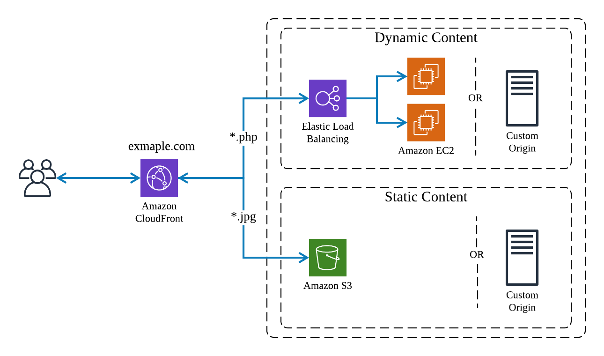

## Amazon CloudFront

Amazon Cloudfront is a global Content Delivery Network(CDN) service. It integrates with other AWS products to give developers and businesses an easy way to distribute content to end users with low latency, high data transfer speeds, and no minimum usage commitments.

### Overview

A Content Delivery Network(CDN) is globally distributed network of caching servers that speed up the downloading of web pages and other content. CDNs use Domain Name System(DNS) geo-location to determine the geographic location of each request for a web page or other content, then they serve that content from edge caching servers closest to that location instead of the original web server. A CDN allow you to increase the scalability of a website or mobile application easily in response to peak traffic spikes. In most cases, using a CDN is completely transparent - end users simply experience better website performance, while the load on your original website is reduced.

Amazon CloudFront is AWS CDN. It can be used to deliver your web content using Amazon's global network of edge locations. When a user requests content that you're serving with Amazon CloudFront, the user is routed to the edge location that provides the lowest latency, so content is delivered with the best possible performance. If the content is already in the edge location with the lowest latency, Amazon CloudFront delivers it immediately. If the content is not currently in edge location, Amazon CloudFront retrieves it from the origin server, such as an Amazon Simple Storage Service(Amazon S3) bucket or a web server, which stores the original, definitive versions of your files.

Amazon CloudFront is optimized to work with other AWS cloud services as the origin server, including Amazon S3 buckets, Amazon S3 static websites, Amazon EC2, and ELB. Amazon CloudFront also  works seamlessly with any no-AWS origin server, such as an existing on-premises web server. Amazon CloudFront also integrates with Amazon Route 53.

Amazon CloudFront supports all content that can be served over HTTP or HTTPS. This includes any popular static files that are part of your web application, such as HTML files, images, JavsScript, and CSS files, and also audio, video, media files, or software downloads. Amazon CloudFront also support serving dynamic web pages, so it can actually be used to deliver your entire website. Finally, Amazon CloudFront supports media streaming, using both HTTP and RTMP.

### Amazon CloudFront Basics

There are three core concepts that you need to understand in order to start using CloudFront: distributions, origins, and cache control. With those concepts, you can easily use CloudFront to speed up delivery of static content from your websites.

#### Distributions

To use Amazon CloudFront, you start by creating a distribution, which is identified by a DNS domain name such as d111111abcdef8.cloudfront.net. To serve files from Amazon CloudFront, you simply use the distribution domain name in place of your website’s domain name; the rest of the file paths stay unchanged. You can use the Amazon CloudFront distribution domain name as-is, or you can create a user-friendly DNS name in your own domain by creating a CNAME record in Amazon Route 53 or another DNS service. The CNAME is automatically redirected to your Amazon CloudFront distribution domain name.

#### Origins 

When you create a distribution, you must specify the DNS domain name of the origin—the Amazon S3 bucket or HTTP server—from which you want Amazon CloudFront to get the definitive version of your objects (web files). For example:
- Amazon S3 bucket: myawsbucket.s3.amazonaws.com
- Amazon EC2 instance: ec2–203–0–113–25.compute-1.amazonaws.com
- Elastic Load Balancing load balancer: my-load-balancer-1234567890.us-west- 2.elb.amazonaws.com
- Website URL: mywebserver.mycompanydomain.com

#### Cache Control

Once requested and served from an edge location, **objects stay in the cache until they expire or are evicted to make room for more frequently requested content**. By default, objects expire from the cache after 24 hours. Once an object expires, the next request results in Amazon CloudFront forwarding the request to the origin to verify that the object is unchanged or to fetch a new version if it has changed.

Optionally, you can control how long objects stay in an Amazon CloudFront cache before expiring. To do this, you can choose to use Cache-Control headers set by your origin server or you can set the minimum, maximum, and default Time to Live (TTL) for objects in your Amazon CloudFront distribution.

You can also remove copies of an object from all Amazon CloudFront edge locations at any time by calling the invalidation Application Program Interface (API). This feature removes the object from every Amazon CloudFront edge location regardless of the expiration period you set for that object on your origin server. The invalidation feature is designed to be used in unexpected circumstances, such as to correct an error or to make an unanticipated update to a website, not as part of your everyday workflow.

Instead of invalidating objects manually or programmatically, it is a best practice to use a version identifier as part of the object (file) path name. For example:

- Old file: assets/v1/css/narrow.css
- New file: assets/v2/css/narrow.css

When using versioning, users always see the latest content through Amazon CloudFront when you update your site without using invalidation. Old versions will expire from the cache automatically.

### Amazon CloudFront Advanced Features

CloudFront can do much more than simply serve static web files. To start using CloudFront’s advanced features, you will need to understand how to use cache behaviors, and how to restrict access to sensitive content.

#### Dynamic Content, Multiple Origins, and Cache Behaviors

Serving static assets, such as described previously, is a common way to use a CDN. An Amazon CloudFront distribution, however, can easily be set up to serve dynamic content in addition to static content and to use more than one origin server. You control which requests are served by which origin and how requests are cached using a feature called cache behaviors.

A cache behavior lets you configure a variety of Amazon CloudFront functionalities for a given URL path pattern for files on your website. For example, One cache behavior applies to all PHP files in a web server (dynamic content), using the path pattern *.php, while another behavior applies to all JPEG images in another origin server (static content), using the path pattern *.jpg.

The functionality you can configure for each cache behavior includes the following:
- The path pattern
- Which origin to forward your requests to
- Whether to forward query strings to your origin
- Whether accessing the specified files requires signed URLs
- Whether to require HTTPS access
- The amount of time that those files stay in the Amazon CloudFront cache (regardless of the value of any Cache-Control headers that your origin adds to the files)

Cache behaviors are applied in order; if a request does not match the first path pattern, it drops down to the next path pattern. Normally the last path pattern specified is * to match all files.

#### Whole Website 

Using cache behaviors and multiple origins, you can easily use Amazon CloudFront to serve your whole website and to support different behaviors for different client devices.

#### Private Content 

In many cases, you may want to restrict access to content in Amazon CloudFront to only selected requestors, such as paid subscribers or to applications or users in your company network. Amazon CloudFront provides several mechanisms to allow you to serve private content. These include:

- Signed URLs 
Use URLs that are valid only between certain times and optionally from certain IP addresses.

- Signed Cookies 
Require authentication via public and private key pairs.

- Origin Access Identities (OAI) 
Restrict access to an Amazon S3 bucket only to a special Amazon CloudFront user associated with your distribution. This is the easiest way to ensure that content in a bucket is only accessed by Amazon CloudFront.

