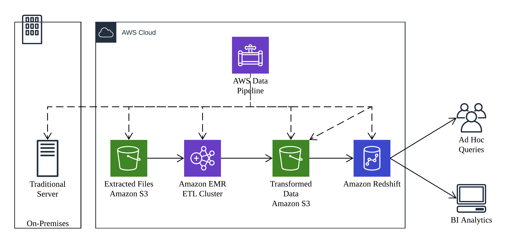

## AWS Data Pipeline

AWS Data Pipeline is a web service that helps you reliably process and move data between differnt AWS compute and storage services, and also on-premises data sources, at specified intervals. With AWS Data Pipeline, you can regularly access your data where it's stored, transform and process it at scale, and efficiently transfer the results to AWS services such as Amazon S3, Amazon Relational Database Service(Amazon RDS), Amazon DynamoDB, and Amazon EMR.

### Overview

Everything in AWS Data Pipeline starts with the pipeline itself. A pipeline schedules and runs tasks according to the pipeline definition. The scheduling is flexible and can run every 15 minutes, every day, every week, and so forth.

The pipeline interacts with data stored in data nodes. Data nodes are locations where the pipeline reads input data or writes output data, such as Amazon S3, a MySQL database, or and Amazon Redshift cluster. Data nodes can be on AWS or on your premises.

The pipeline will execute activities that represent common scenarios, such as moving data from on location to another, running Hive queries, and so forth. Activities may require additional resources to run, such as an Amazon EMR cluter or an Amazon EC2 instance. In these situations, AWS Data Pipeline will automatically launch the required resources and tear them down when the activity is completed.

Distributed data flows often have dependencies; just because an activity is scheduled to run does not mean that there is data waiting to be processed. For situations like this, AWS Data pipeline supports preconditions, which are conditional statements that much be ture before an activity can run. These includes scenarios such as whether an Amazon S3 key is present, whether an Amazon DynamoDB table contains any data, and so forth.

If an activity fails, retry is automatic. The activity will continue to retry up to the limit you configure. You can define actions to take in the event when the activity reaches that limit without succeeding.

### Use Cases

AWS Data Pipeline can be used for virtually any batch mode ETL process. A simple example is shown below:

The pipeline is performing the following workflow:

- Every hour an activity begins to extract log data from on-premises storage to Amazon S3. A precondition checks that there is data to be transferred before actaully starting the activity.
- The next activity launches a transient Amazon EMR cluster that uses the extracted dataset as input, validates and transforms it, and then outputs the data to an Amazon S3 bucket.
- Then final activity moves the transformed data from Amazon S3 to Amazon Redshift via an Amazon Redshift `COPY` command.

AWS Data Pipeline is best for regular batch processes instead of for continuous data streams; use Amazon Kinesis for data streams.