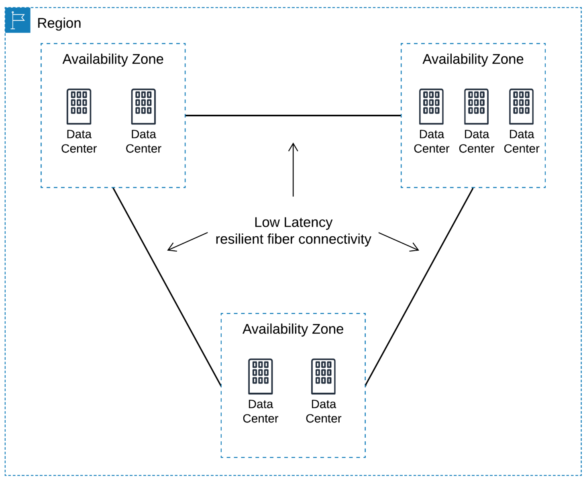

### AWS Global Infrastructure: Availability Zones

Availability Zones and Regions are closely related.

AZs are essentially the physical data centers of AWS. This is where the actual compute, storage, network, and database resources are hosted that we as consumers provision within our Virtual Private Clouds (VPCs). A common misconception is that a single availability zone is equal to a single data center. This is not the case. In fact, it’s likely that multiple data centers located close together form a single availability zone.

Each AZ will always have at least one other AZ that is geographically located within the same area, usually a city, linked by highly resilient and very low latency private fiber optic connections. However, each AZ will be isolated from the others using separate power and network connectivity that minimizes impact to other AZs should a single AZ fail.

These low latency links between AZs are used by many AWS services to replicate data for high availability and resilience purposes. For example, when RDS (Relational Database Service) is configured for ‘Multi-AZ’ deployments, AWS will use synchronous replication between its primary and secondary database and asynchronous replication for any read replicas that have been created.

Often, there are three, four, or even five AZs linked together via these low latency connections. This localized geographical grouping of multiple AZs, which would include multiple data centers, is defined as an AWS Region.

Multiple AZs within a region allows you to create highly available and resilient applications and services. By architecting your solutions to utilize resources across more than one AZ ensures that minimal or no impact will occur to your infrastructure should an AZ experience a failure, which does happen.

Anyone can deploy resources in the cloud, but architecting them in a way that ensures your infrastructure remains stable, available, and resilient when faced with a disaster is a different matter. Making use of at least two AZs in a region helps you maintain high availability of your infrastructure and its always a recommended best practice.

### AWS Global Infrastructure: Regions

As we now know, a Region is a collection of availability zones that are geographically located close to one other. This is generally indicated by AZs within the same city. AWS has deployed them across the globe to allow its worldwide customer base to take advantage of low latency connections. Every Region will act independently of the others, and each will contain at least two Availability Zones.

For example, if an organization based in London was serving customers throughout Europe, there would be no logical sense to deploy services in the Sydney Region simply due to the latency response times for its customers. Instead, the company would select the region most appropriate for them and their customer base, which may be the London, Frankfurt, or Ireland Region.

Having global regions also allows for compliance with regulations, laws, and governance relating to data storage (at rest and in transit). For example, you may be required to keep all data within a specific location, such as Europe. Having multiple regions within this location allows an organization to meet this requirement.

Similarly to how utilizing multiple AZs within a region creates a level of high availability, the same can be applied to utilizing multiple regions. Depending on the level of business continuity you require, you may choose to architect your AWS environment to support your applications and services across multiple regions, should an entire region become unavailable, perhaps due to a natural disaster.

You may want to use multiple regions if you are a global organization serving customers in different countries that have specific laws and governance about the use of data. In this case, you could even connect different VPCs together in different regions.

Interestingly, not all AWS services are available in every region. This is a consideration that must be taken into account when architecting your infrastructure. Some services are classed as global services, such as AWS Identity & Access Management (IAM) or Amazon CloudFront, which means that these services are not tied to a specific region.  However, most services are region-specific, and it’s down to you to understand which services are available in which region. [This table provides a definitive list of all services and the regions where they operate](https://aws.amazon.com/about-aws/global-infrastructure/regional-product-services/).
