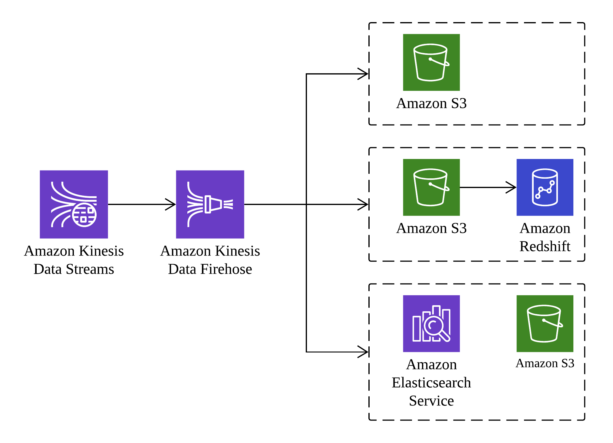

## Amazon Kinesis

Amazon Kinesis is a platform for handling a massive streaming data on AWS, offering powerfull services to make it easy to load and analyze streaming data and providing the ability for you to build custom streaming data applications for specialize needs.

### Overview

Amazon Kinesis is streaming data platform consiting of three services addressing different real-time streaming data challenges:

- Amazon Kinesis Firehose
A service enabling you to load massive volumes of streaming data into AWS

- Amazon Kinesis Steams
A service enabling you to build custom applications for more complex analysis of streaming data in real time

- Amazon Kinesis Analytics
A service enabling you to easily analyze streaming data real time with standard SQL

Each of these services can scale to handle virtually limitless data streams.

### Amazon Kinesis Firehose

Amazon Kinesis Firehose receives stream data and stores it in Amazon S3, Amazon Redshift, or Amazon Elasticsearch. You do not need to write any code, just create a delivery stream and configure the destination for your data. Clients write data to the stream using an AWS API call and the data is automatically sent to the proper destination. The various destination options are shown in this picture:

When configured to save a stream to Amazon S3, Amazon Kinesis Firehose sends the data directly to Amazon S3. For and Amazon Redshift destination, the data is first written to Amazon S3, and then an Amazon Redshift `COPY` command is executed to load the data into Amazon Redshift. Amazon Kinesis Firehose can also write data out to Amazon Elasticsearch, with the option to back the data up concurrently to Amazon S3.

### Amazon Kinesis Streams 

Amazon Kinesis Streams enable you to collect and process large streams of data records in real time. Using AWS SDK, you can create an Amazon Kinesis Streams application that processes the data as it moves through the stream. Because response time for data intake and processing is in near real time, the prcoessing is typically lightweight. Amazon Kinesis Stream can scale to support nearly limitless data streams by distributing incoming data a number of shards. If any shard becomes too busy, it can be further divided into more shards to distribute the load further. The processing is then executed on consumers, which read data from the shards and run the Amazon Kinesis Steams application. The architecture is shown in this picture:

