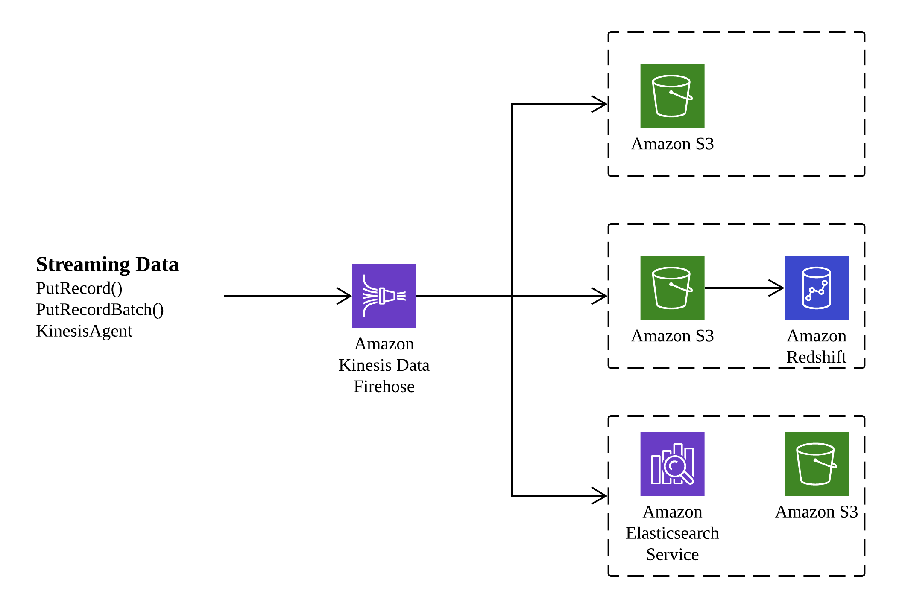
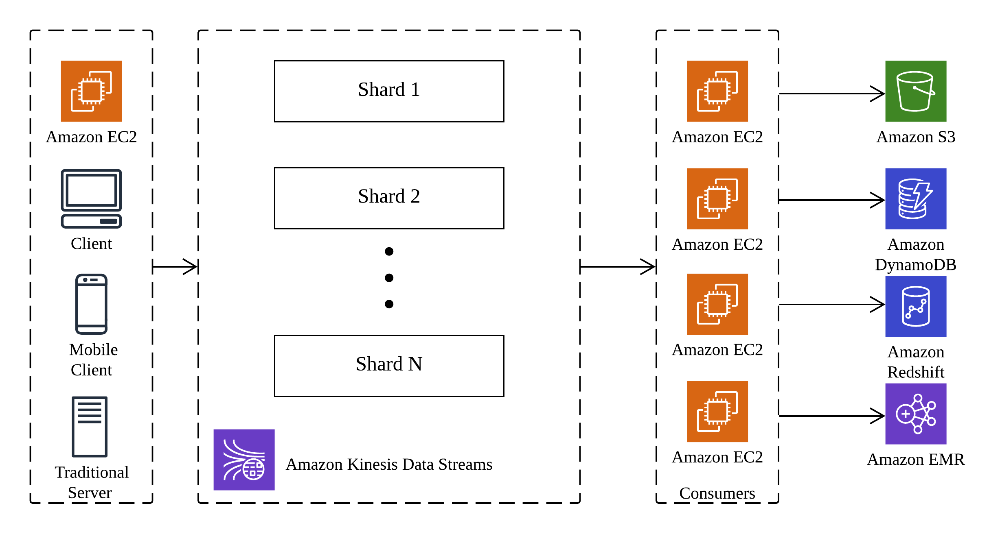

## Amazon Kinesis

Amazon Kinesis is a platform for handling a massive streaming data on AWS, offering powerfull services to make it easy to load and analyze streaming data and providing the ability for you to build custom streaming data applications for specialize needs.

### Overview

Amazon Kinesis is streaming data platform consiting of three services addressing different real-time streaming data challenges:

- Amazon Kinesis Firehose
A service enabling you to load massive volumes of streaming data into AWS

- Amazon Kinesis Steams
A service enabling you to build custom applications for more complex analysis of streaming data in real time

- Amazon Kinesis Analytics
A service enabling you to easily analyze streaming data real time with standard SQL

Each of these services can scale to handle virtually limitless data streams.

### Amazon Kinesis Firehose

Amazon Kinesis Firehose receives stream data and stores it in Amazon S3, Amazon Redshift, or Amazon Elasticsearch. You do not need to write any code, just create a delivery stream and configure the destination for your data. Clients write data to the stream using an AWS API call and the data is automatically sent to the proper destination. The various destination options are shown in this picture:

When configured to save a stream to Amazon S3, Amazon Kinesis Firehose sends the data directly to Amazon S3. For and Amazon Redshift destination, the data is first written to Amazon S3, and then an Amazon Redshift `COPY` command is executed to load the data into Amazon Redshift. Amazon Kinesis Firehose can also write data out to Amazon Elasticsearch, with the option to back the data up concurrently to Amazon S3.

### Amazon Kinesis Streams 

Amazon Kinesis Streams enable you to collect and process large streams of data records in real time. Using AWS SDK, you can create an Amazon Kinesis Streams application that processes the data as it moves through the stream. Because response time for data intake and processing is in near real time, the prcoessing is typically lightweight. Amazon Kinesis Stream can scale to support nearly limitless data streams by distributing incoming data a number of shards. If any shard becomes too busy, it can be further divided into more shards to distribute the load further. The processing is then executed on consumers, which read data from the shards and run the Amazon Kinesis Steams application. The architecture is shown in this picture:

### Amazon Kinesis Data Streams FAQs

Q: What are the limits of Amazon Kinesis Data Streams?

The throughput of an Amazon Kinesis data stream is designed to scale without limits via increasing the number of shards within a data stream. However, there are certain limits you should keep in mind while using Amazon Kinesis Data Streams:

- By default, Records of a stream are accessible for up to 24 hours from the time they are added to the stream. You can raise this limit to up to 7 days by enabling extended data retention.
- The maximum size of a data blob (the data payload before Base64-encoding) within one record is 1 megabyte (MB).
- Each shard can support up to 1000 PUT records per second.
For more information about other API level limits, see [Amazon Kinesis Data Streams Limits](https://docs.aws.amazon.com/streams/latest/dev/service-sizes-and-limits.html).

Q: How does Amazon Kinesis Data Streams differ from Amazon SQS?

Amazon Kinesis Data Streams enables real-time processing of streaming big data. It provides ordering of records, as well as the ability to read and/or replay records in the same order to multiple Amazon Kinesis Applications. The Amazon Kinesis Client Library (KCL) delivers all records for a given partition key to the same record processor, making it easier to build multiple applications reading from the same Amazon Kinesis data stream (for example, to perform counting, aggregation, and filtering).

Amazon Simple Queue Service (Amazon SQS) offers a reliable, highly scalable hosted queue for storing messages as they travel between computers. Amazon SQS lets you easily move data between distributed application components and helps you build applications in which messages are processed independently (with message-level ack/fail semantics), such as automated workflows.

Q: When should I use Amazon Kinesis Data Streams, and when should I use Amazon SQS?

We recommend Amazon Kinesis Data Streams for use cases with requirements that are similar to the following:

- Routing related records to the same record processor (as in streaming MapReduce). For example, counting and aggregation are simpler when all records for a given key are routed to the same record processor.
- Ordering of records. For example, you want to transfer log data from the application host to the processing/archival host while maintaining the order of log statements.
- Ability for multiple applications to consume the same stream concurrently. For example, you have one application that updates a real-time dashboard and another that archives data to Amazon Redshift. You want both applications to consume data from the same stream concurrently and independently.
- Ability to consume records in the same order a few hours later. For example, you have a billing application and an audit application that runs a few hours behind the billing application. Because Amazon Kinesis Data Streams stores data for up to 7 days, you can run the audit application up to 7 days behind the billing application.

We recommend Amazon SQS for use cases with requirements that are similar to the following:

- Messaging semantics (such as message-level ack/fail) and visibility timeout. For example, you have a queue of work items and want to track the successful completion of each item independently. Amazon SQS tracks the ack/fail, so the application does not have to maintain a persistent checkpoint/cursor. Amazon SQS will delete acked messages and redeliver failed messages after a configured visibility timeout.
- Individual message delay. For example, you have a job queue and need to schedule individual jobs with a delay. With Amazon SQS, you can configure individual messages to have a delay of up to 15 minutes.
- Dynamically increasing concurrency/throughput at read time. For example, you have a work queue and want to add more readers until the backlog is cleared. With Amazon Kinesis Data Streams, you can scale up to a sufficient number of shards (note, however, that you'll need to provision enough shards ahead of time).
- Leveraging Amazon SQS’s ability to scale transparently. For example, you buffer requests and the load changes as a result of occasional load spikes or the natural growth of your business. Because each buffered request can be processed independently, Amazon SQS can scale transparently to handle the load without any provisioning instructions from you.