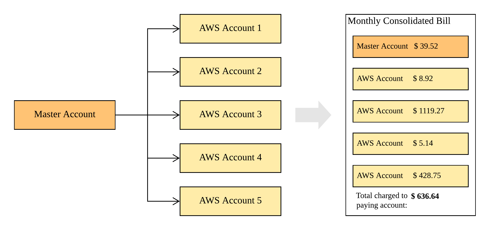

## Consolidated billing process

AWS Organizations provides consolidated billing so that you can track the combined costs of all the linked accounts in your organization. The following steps provide an overview of the process for creating an organization and viewing your consolidated bill.

The payer account is billed for all charges of the linked accounts. However, unless the organization is changed to support all features in the organization (not consolidated billing features only) and linked accounts are explicitly restricted by policies, each linked account is otherwise independent from the other linked accounts. For example, the owner of a linked account can sign up for AWS services, access resources, and use AWS Premium Support unless the payer account restricts those actions. Each account owner continues to use their own IAM user name and password, with account permissions assigned independently of other accounts in the organization.