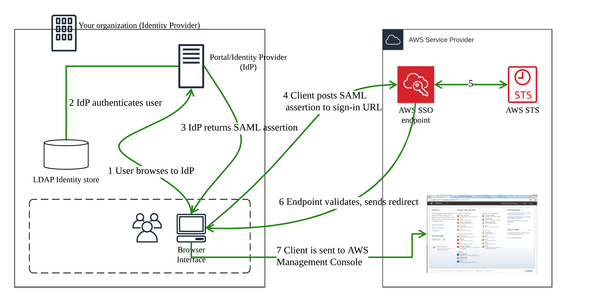

## Enabling SAML 2.0 Federated Users to Access the AWS Management Console

The following diagram illustrates the flow for SAML-enabled single sign-on.

The diagram illustrates the following steps:

- The user browses to your organization's portal and selects the option to go to the AWS Management Console. In your organization, the portal is typically a function of your IdP that handles the exchange of trust between your organization and AWS. For example, in Active Directory Federation Services, the portal URL is: https://ADFSServiceName/adfs/ls/IdpInitiatedSignOn.aspx

- The portal verifies the user's identity in your organization.

- The portal generates a SAML authentication response that includes assertions that identify the user and include attributes about the user. You can also configure your IdP to include a SAML assertion attribute called SessionDuration that specifies how long the console session is valid. You can also configure the IdP to pass attributes as session tags. The portal sends this response to the client browser.
- The client browser is redirected to the AWS single sign-on endpoint and posts the SAML assertion.
- The endpoint requests temporary security credentials on behalf of the user and creates a console sign-in URL that uses those credentials.
- AWS sends the sign-in URL back to the client as a redirect.
- The client browser is redirected to the AWS Management Console. If the SAML authentication response includes attributes that map to multiple IAM roles, the user is first prompted to select the role for accessing the console.